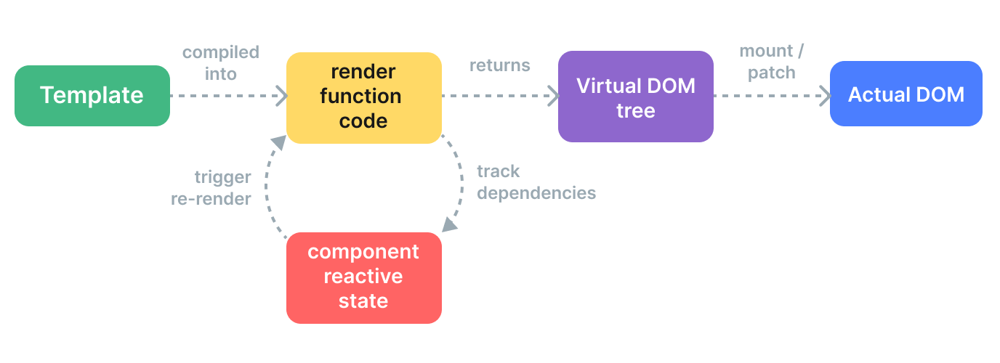

# 响应式系统
## 响应式原理
### 什么是响应式
响应式是指系统或程序能够自动追踪数据变化，并在数据发生变化时自动更新与之相关的视图或执行特定的操作。  
但JS本身是不支持响应式的，例如：  
```js
let A0 = 1
let A1 = 2
let A2 = A0 + A1

console.log(A2) // 3

A0 = 2
console.log(A2) // 仍然是 3
```
对于以上例子，如果是响应式的，那么最后输出的A2应该是4。  
那么我们如何在 JavaScript 中做到这一点呢？首先，为了能重新运行计算的代码来更新 A2，我们需要将其包装为一个函数：
```js
let A2

function update() {
  A2 = A0 + A1
}
```
然后，我们需要定义几个术语：  
这个 update() 函数会产生一个**副作用**，或者就简称为作用 (effect)，因为它会更改程序里的状态。  
A0 和 A1 被视为这个作用的**依赖** (dependency)，因为它们的值被用来执行这个作用。因此这次作用也可以被称作它的依赖(A0, A1)的一个订阅者 (subscriber)。  
我们需要一个“魔法函数”，它能够在 A0 或 A1 (这两个依赖) 变化时调用 update() (产生作用)。  
```js
whenDepsChange(update)
```
这个 `whenDepsChange()` 函数有如下的任务：  
- 当一个变量被读取时进行追踪。例如我们执行了表达式 A0 + A1 的计算，则 A0 和 A1 都被读取到了，所以要对它们进行追踪。  
- 如果一个变量在当前运行的副作用中被读取了，就将该副作用设为此变量的一个订阅者。例如由于 A0 和 A1 在 update() 执行时被访问到了，则 update() 需要在第一次调用之后成为 A0 和 A1 的订阅者。  
- 探测一个变量的变化。例如当我们给 A0 赋了一个新的值后，应该通知其所有订阅了的副作用重新执行。
### Vue2如何实现响应式
Vue2中响应式的设计总体来看是采用了订阅-发布设计模式，它整个代码实现响应式实质就完成了两个功能，依赖收集和变化时更新，分别对应的就是“订阅”和“发布”。  
下面详细介绍Vue2中实现响应式的各种机制。
#### 将数据变成响应式
使用`Object.defineProperty`函数将data对象中所有数据变成响应式的。`Object.defineProperty`能够让我们重写data对象中数据（key）的get, set方法，这就给了我们可操作空间。  
我们可以在get方法中进行依赖收集，因为get方法被调用表明这个数据被访问，既然它被访问就说明肯定有其他项依赖于这个数据，所以这时候我们就可以将这些依赖项收集起来。  
我们可以在set方法中修改数据值的同时进行“通知”，因为set方法被调用表明数据的值被修改了，要想让数据变成响应式，那么我们在get方法中收集的当前数据的依赖项需要知道它所依赖的数据发生了改变，自身应该进行相应更新，因此，我们在set方法中需要“通知”那些之前收集的依赖项（也就是调用它们的update函数）。  
每个属性的依赖项watcher都存储在了对应的dep实例中，后续getter, setter能够访问到各依赖项是利用了JS的**闭包机制**。
```js
// 定义响应式函数
function defineReactive(obj, key, val) {
    let dep = new Dep() // 每个属性都有一个对应的 Dep 实例

    // 如果值是对象，递归监听其属性
    observe(val)

    Object.defineProperty(obj, key, {
        get() {
            if (Dep.target) {
                dep.addSub() // 将当前的 Watcher 添加到该属性的 dep 中
            }
            return val
        },
        set(newVal) {
            if (newVal !== val) {
                val = newVal
                observe(newVal) // 如果新值是对象，递归进行监听
                dep.notify() // 通知所有依赖进行更新
            }
        }
    })
}

// 遍历对象的每个属性，递归调用 defineReactive
function observe(obj) {
    if (obj && typeof obj === 'object') {
        for (let key in obj) {
            defineReactive(obj, key, obj[key])
        }
    }
}
```
#### Dep依赖收集  
之前说到在getter, setter中进行依赖收集和依赖更新，依赖的管理是通过Dep这个类来进行的。这个类有两个方法，一个用于收集依赖，一个用于通知依赖项进行更新。  
上面说的依赖，在订阅-发布模式中其实也就是观察者（Watcher），观察其他数据项的变化，对观察的数据来说就是依赖于自身的依赖项。观察者也是一个类，用于管理依赖自身的行为，例如更新操作等。  
Dep中的target为一个全局变量，它用来存储程序运行时触发了getter的 watcher ，即活跃的 watcher 。因为JS为单线程的语言，每个时刻都只有一个任务在运行，所以我们可以使用这一个全局变量来存储当前活跃的 watcher 。
```js
// Dep 用于管理所有的 Watcher
class Dep {
    static target = null  // 用于存放当前活跃的 watcher

    constructor() {
        this.subs = [] // 存放所有的 Watcher
    }

    addSub() {
        if (!this.subs.includes(Dep.target)) {
            this.subs.push(Dep.target) // 添加 Watcher 到 subs 数组
        }
    }

    notify() {
        this.subs.forEach(watcher => watcher.update()) // 通知所有 Watcher 执行更新
    }
}
``` 
#### Watcher观察者
Watcher类用于观察/监听数据变化，同时在数据发生变化被通知要更新时，对观察的数据进行更新。即当依赖收集的时候会addSub到sub中，在修改data中数据的时候会触发dep对象的notify，通知所有Watcher对象去修改对应视图。  
触发对应属性getter之前要先将Dep.target设置为当前的watcher，这样触发getter后才能将当前watcher收集进依赖数组中，同时触发完后要清楚Dep.target。
```js
// Watcher类
class Watcher {
  constructor(obj, key, fn) {
    this.obj = obj  // 监听的对象
    this.key = key  // 监听的属性
    this.fn = fn    // 回调函数

    this.get()      // 初始时执行 get 方法，收集依赖
  }

  // 通过执行回调触发 getter，收集依赖
  get() {
    Dep.target = this  // 设置 Dep.target 为当前 Watcher
    this.obj[this.key] // 访问对象的指定属性，触发 getter
    Dep.target = null  // 清除 Dep.target
  }

  // 数据变化时调用 update 方法，执行回调
  update() {
    this.fn(this.key, this.obj[this.key])  // 重新执行回调
  }
}
```  
#### Vue类  
以下为简单的Vue类的实现，只实现将数据变为响应式的部分。  
```js
// Vue 类（只负责将数据变成响应式）
class Vue {
  constructor(options) {
    this._data = options.data || {} // 获取传入的 data

    // 将 data 中的所有属性转为响应式
    this._initData()
  }

  // 初始化响应式数据
  _initData() {
    for (let key in this._data) {
      defineReactive(this._data, key, this._data[key])
      new Watcher(this._data, key, (key, val)=>{  //为所有数据都创建一个Watcher类对其进行监听
        console.log(`${key} updates to ${val}`)
      }) 
    }
  }
}
```  
#### 代理  
现在以上部分的代码虽然可以实现数据的响应式，但是每次访问数据都要通过_data属性访问数据：`app._data.attr`，这样比较麻烦。为了可以直接访问数据，我们可以在Vue中做一个代理，将_data的数据代理到Vue实例上，这样直接通过Vue实例即可访问/修改数据，同时也能够触发setter进行相应更新。  
假设数据中有个name数据，未做代理前要想访问数据同时触发setter需要这样访问：`app._data.name` 。做了代理后可以直接这样访问：`app.name`，也能触发setter。
```js
// Vue 类(只负责将数据变成响应式)
class Vue {
  constructor(options) {
    this._data = options.data || {} // 获取传入的 data

    // 将 data 中的所有属性转为响应式
    this._initData()
    // 将 _data 中数据代理到 Vue 实例中
    this._proxy(this._data)
  }

  // 初始化响应式数据
  _initData() {
    for (let key in this._data) {
      defineReactive(this._data, key, this._data[key])
      new Watcher(this._data, key, (key, val)=>{
        console.log(`${key} updates to ${val}`)
      })
    }
  }

  _proxy(data) {
    Object.keys(data).forEach(key => {
        Object.defineProperty(this, key, {
            configurable: true,
            enumerable: true,
            get() {
                return this._data[key]
            },
            set(val) {
                this._data[key]=val
            }
        })
    })
  }
}
```
#### 完整代码+测试代码
```js
// 定义响应式函数
function defineReactive(obj, key, val) {
  let dep = new Dep() // 每个属性都有一个对应的 Dep 实例
  
  // 如果值是对象，递归监听其属性
  observe(val)

  Object.defineProperty(obj, key, {
    get() {
      if (Dep.target) {
        dep.addSub(Dep.target) // 将当前的 Watcher 添加到该属性的 dep 中
      }
      return val
    },
    set(newVal) {
      if (newVal !== val) {
        val = newVal
        observe(newVal) // 如果新值是对象，递归进行监听
        dep.notify() // 通知所有依赖进行更新
      }
    }
  })
}

// 遍历对象的每个属性，递归调用 defineReactive
function observe(obj) {
  if (obj && typeof obj === 'object') {
    for (let key in obj) {
      defineReactive(obj, key, obj[key])
    }
  }
}

// Dep 用于管理所有的 Watcher
class Dep {
  constructor() {
    this.subs = [] // 存放所有的 Watcher
  }

  addSub(watcher) {
    if (!this.subs.includes(watcher)) {
      this.subs.push(watcher) // 添加 Watcher 到 subs 数组
    }
  }

  notify() {
    this.subs.forEach(watcher => watcher.update()) // 通知所有 Watcher 执行更新
  }
}

// Watcher 类
class Watcher {
  constructor(obj, key, fn) {
    this.obj = obj  // 监听的对象
    this.key = key  // 监听的属性
    this.fn = fn    // 回调函数

    this.get()      // 初始时执行 get 方法，收集依赖
  }

  // 通过执行回调触发 getter，收集依赖
  get() {
    Dep.target = this  // 设置当前 Watcher 为 Dep.target
    this.obj[this.key] // 访问对象的指定属性，触发 getter
    Dep.target = null  // 清除 Dep.target
  }

  // 数据变化时调用 update 方法，执行回调
  update() {
    this.fn(this.key, this.obj[this.key])  // 重新执行回调
  }
}


// Vue 类(只负责将数据变成响应式)
class Vue {
  constructor(options) {
    this._data = options.data || {} // 获取传入的 data

    // 将 data 中的所有属性转为响应式
    this._initData()
    this._proxy(this._data)
  }

  // 初始化响应式数据
  _initData() {
    for (let key in this._data) {
      defineReactive(this._data, key, this._data[key])
      new Watcher(this._data, key, (key, val)=>{
        console.log(`${key} updates to ${val}`)
      })
    }
  }

  _proxy(data) {
    Object.keys(data).forEach(key => {
        Object.defineProperty(this, key, {
            configurable: true,
            enumerable: true,
            get() {
                return this._data[key]
            },
            set(val) {
                this._data[key]=val
            }
        })
    })
  }
}

// 测试代码
let app = new Vue({
  data: {
    name: 'Vue',
    age: 2
  }
})

// 修改数据，自动触发 Watcher 的更新
app.name = 'vue2'  // 会触发 name 的 Watcher 的 update
app.age = 21  // // 会触发 age 的 Watcher 的 update
```

# 渲染机制
具体内容详见[官方文档](https://cn.vuejs.org/guide/extras/rendering-mechanism.html)  
## 补充  
### 编译  
从template模版到render function，需要经历几个过程：  
1. parse 
这个过程将template模版编译为AST（抽象语法树）  
2. optimize 
这个过程就是编译中的优化过程  
3. generate 
这个过程将AST转换为render function  

# Vue整个生命过程  
可以参考[从template到DOM](https://github.com/answershuto/learnVue/blob/master/docs/%E4%BB%8Etemplate%E5%88%B0DOM(Vue.js%E6%BA%90%E7%A0%81%E8%A7%92%E5%BA%A6%E7%9C%8B%E5%86%85%E9%83%A8%E8%BF%90%E8%A1%8C%E6%9C%BA%E5%88%B6).MarkDown)这篇文章

让我们从这张生命周期图来讲解。首先，一切从我们new了一个Vue对象开始，这个对象会调用一个_init方法，这个方法的任务就是进行各种初始化任务，在beforeCreate和created钩子中间会干一件很重要的事情，就是把模版中那些数据变成响应式的。  
created钩子后，就进入到渲染阶段（详见渲染机制），也就是下面这张图片：  

当响应式数据变化时会重新生成一个VDOM，然后与旧的VDOM比较，进行diff比较，最小化更新部分。  

# 异步更新
可以参考[Vue.js异步更新DOM策略及nextTick](https://github.com/answershuto/learnVue/blob/master/docs/Vue.js%E5%BC%82%E6%AD%A5%E6%9B%B4%E6%96%B0DOM%E7%AD%96%E7%95%A5%E5%8F%8AnextTick.MarkDown)这篇文章  
